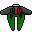
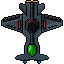
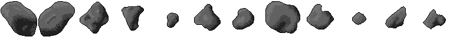
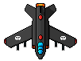
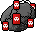
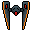
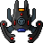
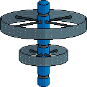

# Contributing — Game Balance Reference

A reference for the game's tuning data, generated from `src/config.ts`, `src/game/WaveManager.ts`, and `src/game/EnemyPool.ts`. Image paths are repo-relative (under `public/`). Numbers are the current v1.1 values — if you retune `config.ts`, update the tables here too.

---

## 1. Levels (Waves) & XP Gain

Each wave spawns a budget of `6 + 2·(n−1)` regular enemies, with capstones (mini-boss / boss) spliced in on milestone waves. XP comes from **kills** plus **Star pickups** — Stars drop on ~5% of normal kills (`STAR.dropChance`) and are **guaranteed** from every mini-boss and boss, each worth **12 XP**.

The "≈ XP gained" column assumes most Stars are collected. It's a rough estimate — actual XP swings with the random enemy roll and how many Asteroids fully fragment. Per-enemy XP values are in table 3's notes.

| Wave | What's new | Spawn budget | Capstone | ≈ XP gained |
|-----:|------------|-------------:|----------|------------:|
| 1  | Swarmers only | 6  | — | ~15 |
| 2  | Gunners join the mix | 8  | — | ~30 |
| 3  | Asteroids (split on death) | 10 | — | ~55 |
| 5  | — | 14 | Mini-boss (+ guaranteed Star) | ~120 |
| 6  | Mines | 16 | — | ~90 |
| 8  | HP ramp steepens (late scaling) | 20 | — | ~110 |
| 10 | — | 24 | **Boss** (+ guaranteed Star) | ~195 |
| 15 | Wardens, Bombers, Gunner bursts | 34 | Mini-boss | ~255 |
| 20 | SpaceStations | 44 | Boss | ~370 |
| 25 | Relentless endgame: a mini-boss **every** wave | 54 | Mini-boss (flat HP) | ~425 |
| 30 | — | 64 | Boss **+** Mini-boss | ~555 |

**Level-up threshold curve** (player levels, distinct from waves): first level-up needs `20` XP (`XP.baseThreshold`); each threshold then grows ×`1.1` per level up to level 10, and ×`1.16` after that — so late-game enemy floods don't over-level you. Tuned toward ~30 level-ups on an average run (~wave 9) and ~50 on a great run (~wave 19).

---

## 2. Powerups (Upgrade Cards) — Tiers & Drop Chances

On each level-up you're offered 3 distinct, not-yet-maxed cards, drawn by **weight**. A rarity tier maps to a base draw weight (ADR-0009): **common 12 / uncommon 8 / rare 4 / epic 2 / legendary 1**; intra-tier exceptions are expressed via `cap`, not weight.

The "Draw chance" below is each card's share of the full pool (total weight = 81, all cards available). As cards hit their cap and leave the pool, the remaining weights redistribute, so real-run chances drift upward.

| Powerup | Tier | Weight | Draw chance | Cap | Effect |
|---------|------|-------:|------------:|----:|--------|
| Shooting Power | common | 12 | 14.8% | ∞ | +6 bullet damage |
| Engine | common | 12 | 14.8% | 10 | Faster, more responsive movement |
| Rapid Fire | common | 12 | 14.8% | ∞ | ×0.95 shot cooldown |
| Tractor Beam | common | 12 | 14.8% | 5 | +120 Star pickup range |
| Piercing | uncommon | 8 | 9.9% | 5 | Bullets pass through +1 enemy |
| Burn | uncommon | 8 | 9.9% | 10 | Hits apply damage-over-time |
| Explosive | rare | 4 | 4.9% | 10 | Bullets explode on impact (AoE) |
| Reinforced Hull | rare | 4 | 4.9% | ∞ | +25 max HP (and heal) |
| Homing | epic | 2 | 2.5% | 3 | Bullets curve toward nearest enemy |
| Extra Life | epic | 2 | 2.5% | 3 | +1 life |
| Missiles | epic | 2 | 2.5% | ∞ | Auto-launches an AoE missile every 1s (+damage/level) |
| Multishot | legendary | 1 | 1.2% | 10 | +1 projectile per shot |
| Bounce | legendary | 1 | 1.2% | 3 | Each hit spawns a full clone bullet; chains deeper per level |
| Drones | legendary | 1 | 1.2% | 3 | Orbiting drone fires a laser whose damage builds while it keeps firing (uncapped, kept across kills) and cools only while idle; +1 drone/level |

The only in-world pickup is the **Star** (`Credits-Sheet.png`), a spinning coin worth 12 XP — see table 1 for its drop rules.

---

## 3. Enemies

| Sprite | Enemy | Introduced | Description |
|--------|-------|-----------:|-------------|
|  | **Swarmer** | Wave 1 | Fast, low-HP contact enemy that dives in a sine-sway weave. No guns — the threat is the collision. |
|  | **Gunner** | Wave 2 | Tougher, slower ship that fires aimed shots. From wave 15 it fires 3-shot bursts down one line (dodge sideways). |
|  | **Asteroid** | Wave 3 | Drifting rock that deals contact damage and splits large → medium → small on death (+1 extra split every 4 waves). |
|  | **Mini-boss** | Wave 5 | A scaled-up Gunner capstone: descends, settles, strafes, and fires a 3-shot fan. From wave 25 one appears every wave (flat HP). |
|  | **Mine** | Wave 6 | Flying explosive that locks one aimed course at spawn, flies it straight, and detonates for player-only AoE on contact or when shot. |
|  | **Boss** | Wave 10 | The every-10th-wave anchor. Lives at the top, drifts, then dashes sideways while raining a downward bullet "curtain." Tanky and elaborate. |
|  | **Warden** | Wave 15 | Slow tank ringed by an orbiting shield of destructible Nodes — a rotating gap lets your upward shots through, or blast the Nodes open. |
|  | **Bomber** | Wave 15 | The Mine's re-aiming cousin (first animated enemy). Re-targets your current position every ~3s, telegraphs, then bursts toward you and detonates. |
|  | **SpaceStation** | Wave 20 | Slow, heavy fortress that lingers and rakes a vertical comb of pure-horizontal bullets out both flanks; thread the gaps or leave its band. |

**Per-kill XP** (`config.ts` → `XP`): Swarmer 2 · Gunner 4 · Asteroid 4/2/1 (large/medium/small) · Mine 4 · Bomber 6 · Warden 14 · SpaceStation 16 · Mini-boss 30 · Boss 60. Star pickup: 12.
