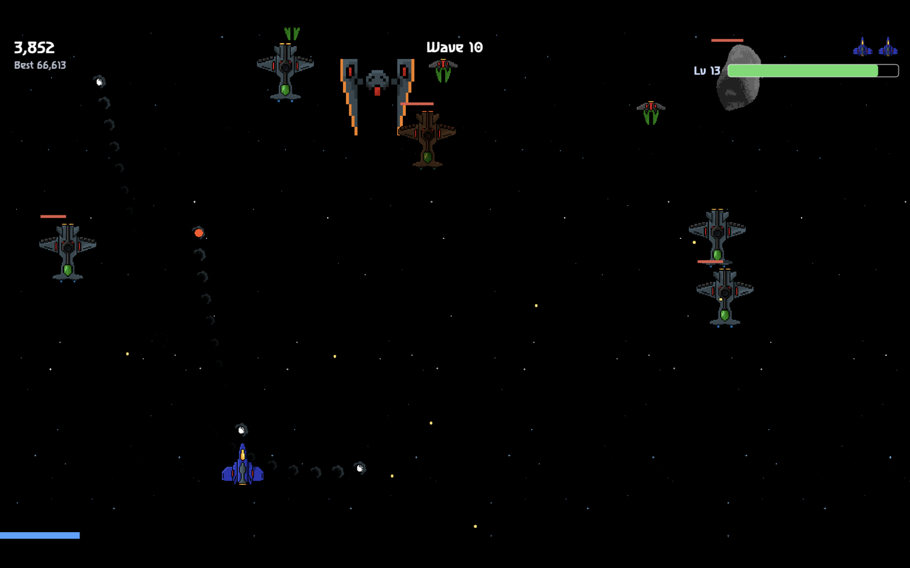
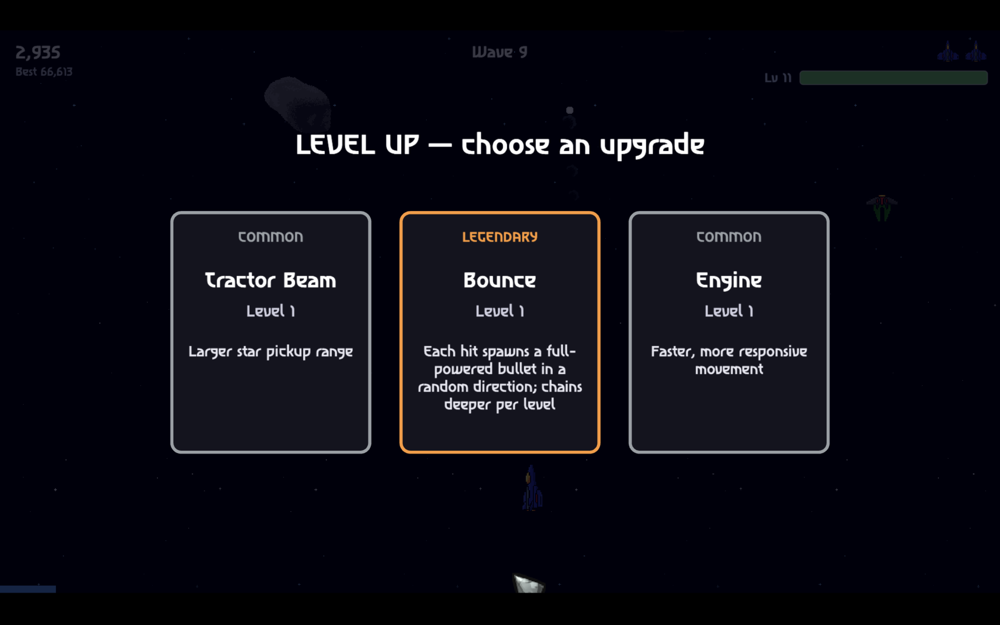
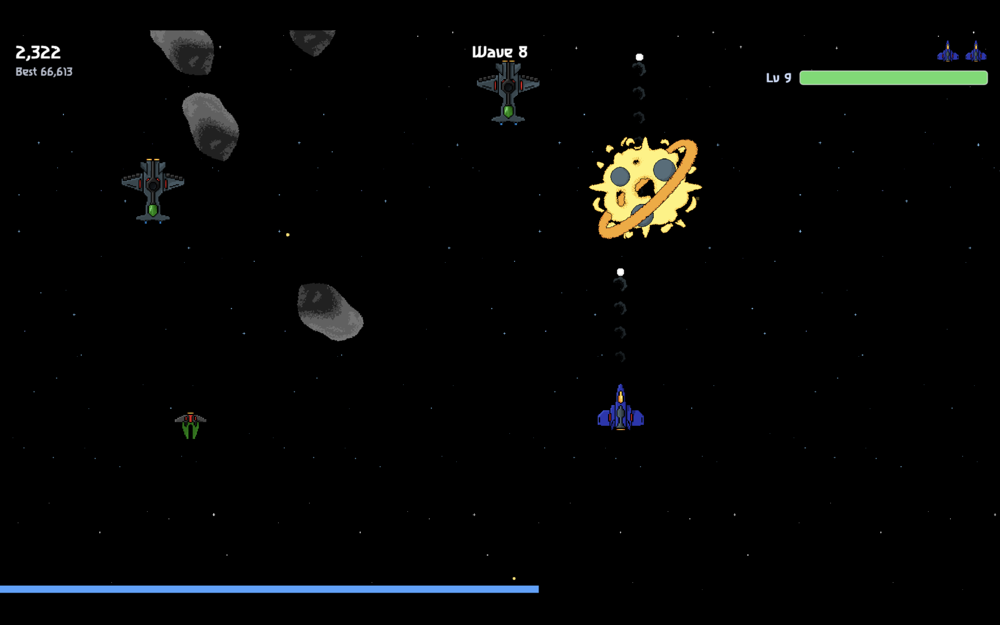
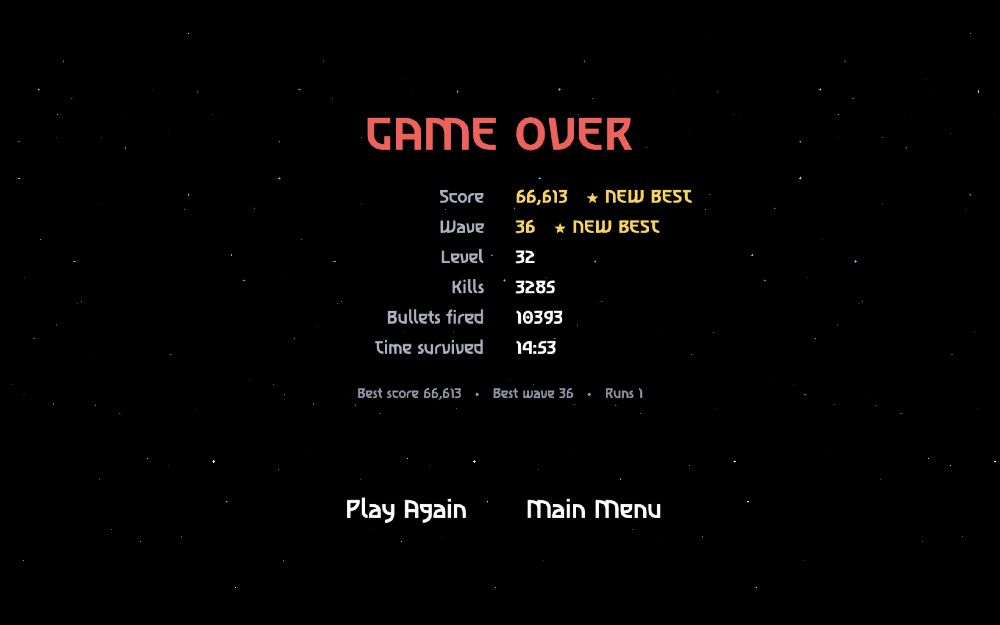
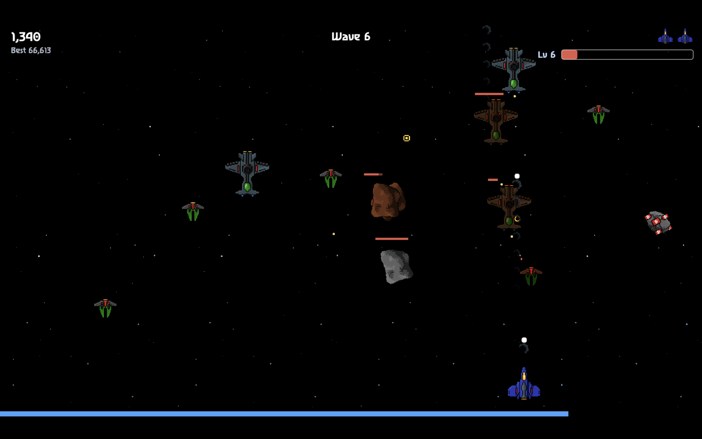
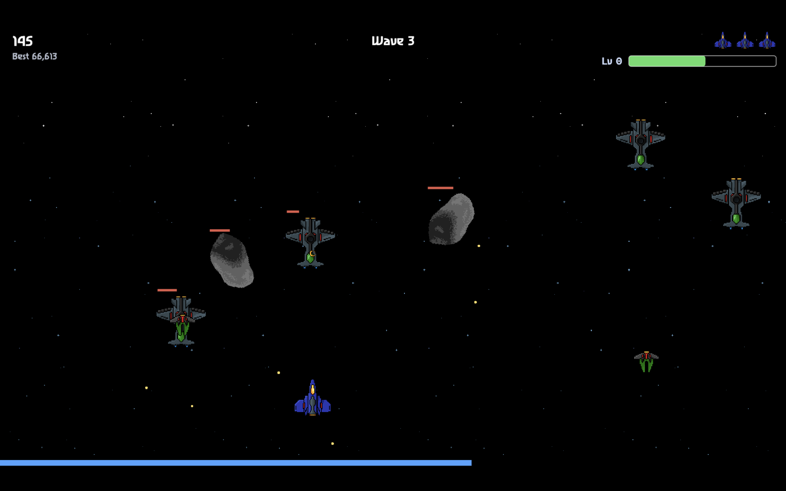

# Spaceshooter 3

**[▶ Play now in your browser](https://casmo.itch.io/spaceshooter-3)**

A fast, endless space shooter you play right in your browser. Dodge, blast, and
survive wave after wave of enemies — then, between the chaos, stack powerups onto
your ship and weapon until your bullets do gloriously ridiculous things. No two
runs play the same.

## Features

- Stack bullet powerups — multishot, homing, pierce, explosive and more — into wild, run-defining combos
- Hold out against endless, escalating waves — a mini-boss waits at every fifth one, and past wave 25 the endgame turns relentless: a mini-boss in *every* wave
- Level up mid-fight and choose upgrades across five rarity tiers
- Pure roguelike: every run starts fresh, nothing to grind, everything to lose
- Runs in any modern browser — no install, no download

## Screenshots

| | |
|---|---|
|  |  |
|  |  |
|  |  |

## Credits

- Art by [Lil Cthulhu](https://lil-cthulhu.itch.io)
- Sound effects by [Phoenix1291](https://phoenix1291.itch.io/sound-effects-pack-2)
- Music by [Creative Core Studio (Mr.Cat)](https://creative-core-studio.itch.io/free-mrcat-bit-piano-music)

All of the above are credited in-game; all code was generated by an LLM.

## Running locally

Built with PixiJS, TypeScript, and Vite.

```sh
git clone https://github.com/Casmo/spaceshooter-3.git
cd spaceshooter-3
npm install
npm run dev      # start the dev server
npm run build    # produce a production build
```
